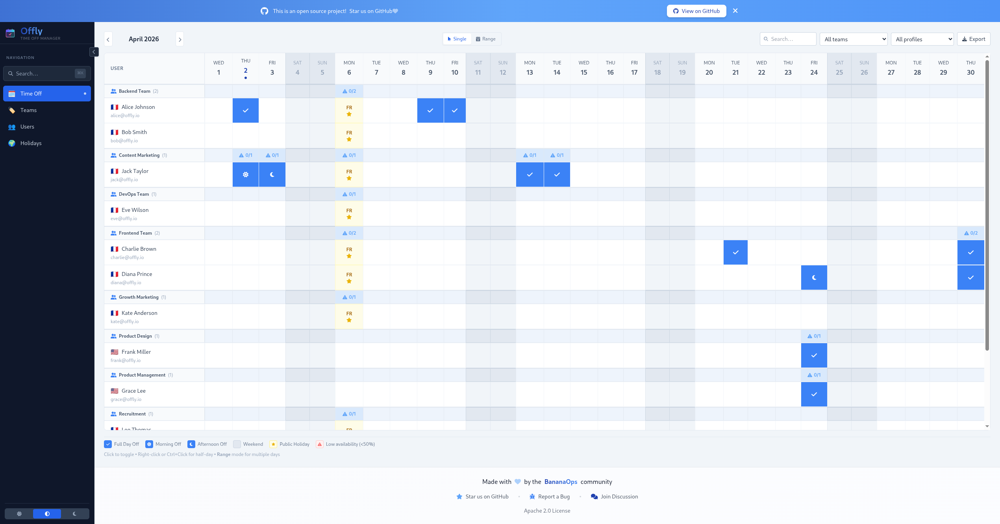
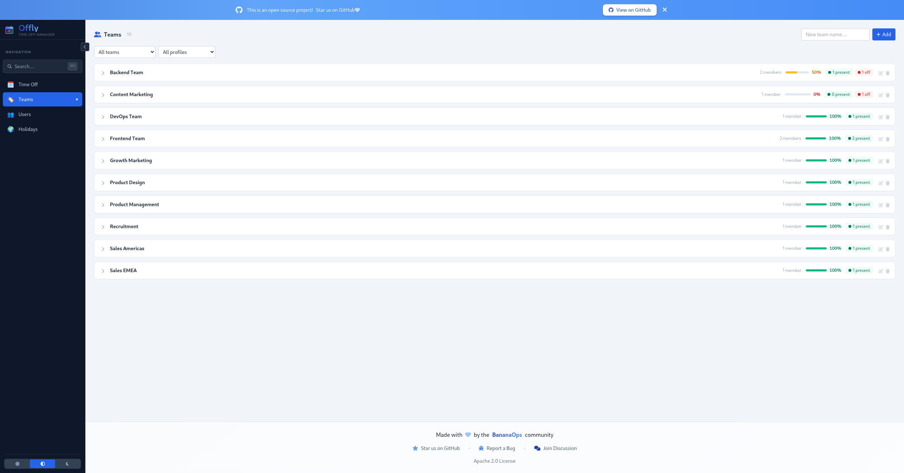
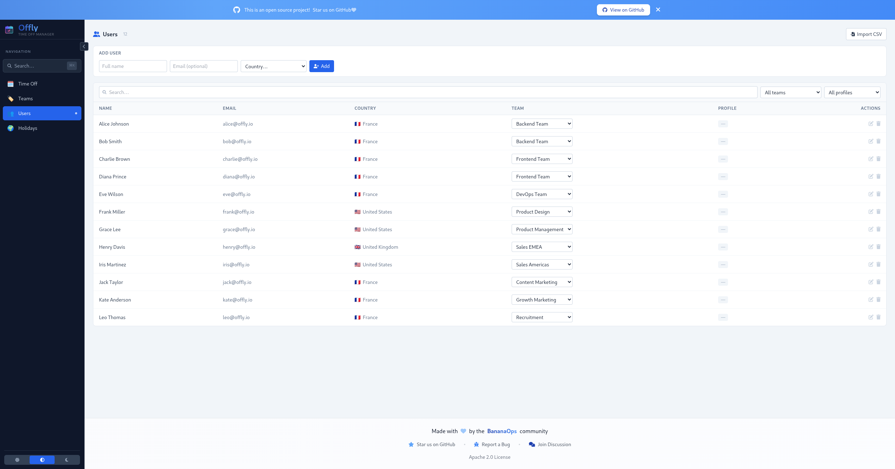
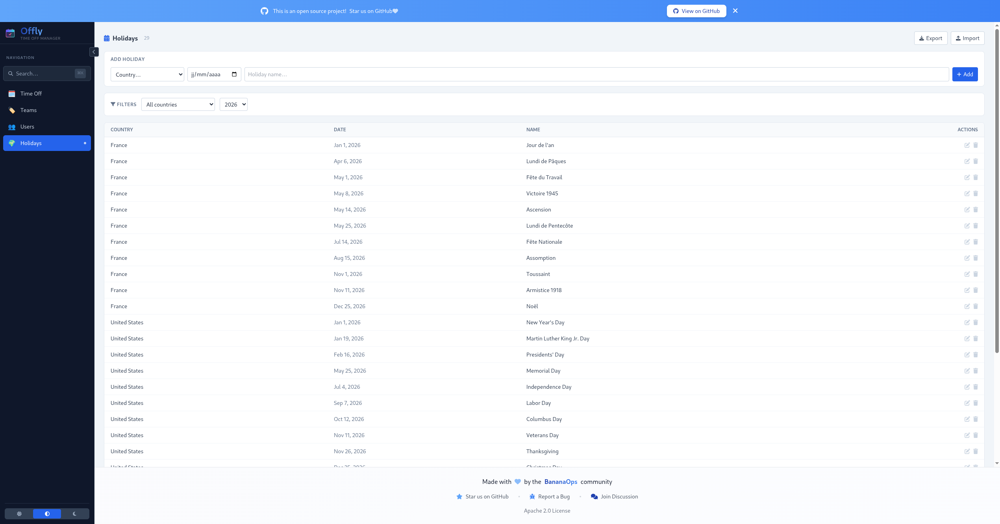

<div align="center">

# 🌴 Offly — Time Off Manager

**Modern absence & time off management. Simple, fast, self-hosted.**

[](https://github.com/BananaOps/offly/releases)
[](LICENSE)
[](https://github.com/BananaOps/offly/actions/workflows/go-test.yml)
[](https://github.com/BananaOps/offly/actions/workflows/protobuf.yml)
[](https://hub.docker.com/r/bananaops/offly)
[](https://hub.docker.com/r/bananaops/offly)
[](https://go.dev)
[](https://nodejs.org)
[](https://vite.dev)
[](https://github.com/BananaOps/offly/stargazers)
[](https://github.com/BananaOps/offly/issues)

</div>

---

> 📖 **New here?** Check out the [Quick Start Guide](QUICKSTART.md) to get up and running in 5 minutes!

## ✨ Features

| Feature | Description |
|---------|-------------|
| 📅 **Calendar Grid** | Visual month-by-month absence grid per user & team |
| 👥 **Team Management** | Organize users into teams with availability tracking |
| 🏖️ **Absence Types** | Full day, morning only, afternoon only |
| 🌍 **Public Holidays** | Per-country holiday management |
| 🔍 **Quick Search** | Instant search across users and teams |
| 🌙 **Dark Mode** | Full light/dark theme support |
| 📊 **Presence View** | Real-time daily attendance overview |
| 📤 **Export** | CSV and PDF export of absence reports |
| 🔐 **SSO / OIDC** | Optional SSO authentication via Dex (PKCE flow) |
| 🛡️ **RBAC** | Role-based access control (admin / user) |
| 🚀 **Self-hosted** | Single Docker image — no external services required |

## 📸 Screenshots

| Calendar View | Teams |
|---|---|
|  |  |

| Users | Holidays |
|---|---|
|  |  |

## 🏗️ Architecture

```
┌─────────────────────────────────────────────────────────┐
│                     Browser (React)                      │
│         TypeScript · Tailwind CSS · Vite 8              │
└───────────────────────┬─────────────────────────────────┘
                        │ HTTP / REST
┌───────────────────────▼─────────────────────────────────┐
│                    Go Backend                            │
│   gRPC · gRPC-Gateway · Protocol Buffers                │
├─────────────────┬───────────────────────────────────────┤
│   SQLite (default)    │   MongoDB (optional)            │
└───────────────────────┴─────────────────────────────────┘
```

The **single Docker image** embeds both the Go binary and the compiled React SPA. The backend serves the frontend static files and provides the REST/gRPC API.

## 🛠️ Tech Stack

| Layer | Technology |
|-------|-----------|
| Backend | Go 1.26, gRPC, gRPC-Gateway, Protocol Buffers |
| Frontend | React 18, TypeScript 5, Tailwind CSS 3, Vite 8 |
| Database | SQLite (default) · MongoDB (optional) |
| Auth | Dex (OIDC/PKCE), JWT, JWKS |
| Container | Docker (multi-stage, Alpine) |
| Orchestration | Kubernetes · Helm · Skaffold |
| CI/CD | GitHub Actions (SHA-pinned) |

## 📋 Prerequisites

| Tool | Version | Purpose |
|------|---------|---------|
| [Go](https://go.dev) | 1.26+ | Backend |
| [Node.js](https://nodejs.org) | 24+ | Frontend |
| [Task](https://taskfile.dev) | latest | Task runner |
| [Buf](https://buf.build) | latest | Protobuf tooling |
| [Docker](https://docker.com) | latest | Containers |

## 🚀 Quick Start

### Option 1 — Docker Compose (recommended)

```bash
docker-compose up -d
```

The application is available at **http://localhost:8080**

### Option 2 — Local development

```bash
# Clone
git clone https://github.com/BananaOps/offly.git && cd offly

# Install all dependencies and generate protobuf code
task setup

# Start the app (backend + frontend with hot reload)
task dev
```

| Service | URL |
|---------|-----|
| Web UI | http://localhost:3000 |
| REST API | http://localhost:8080/api/v1 |
| Swagger UI | http://localhost:8080/docs |
| gRPC | localhost:50051 |

### Seed test data

```bash
# Requires k6 — see k6-README.md
k6 run k6-seed-data.js
```

Creates 5 departments, 10 teams, 12 users, 29 public holidays, and random absences.

## 🐳 Docker

```bash
# Pull & run (in-memory storage — no DB required)
docker run -p 8080:8080 bananaops/offly:latest

# With persistent SQLite
docker run -p 8080:8080 \
  -v $(pwd)/data:/app/data \
  bananaops/offly:latest

# With MongoDB
docker run -p 8080:8080 \
  -e STORAGE_TYPE=mongodb \
  -e MONGO_URI=mongodb://host.docker.internal:27017 \
  bananaops/offly:latest
```

See [DOCKER.md](DOCKER.md) for the full deployment guide.

## ☸️ Kubernetes (Helm)

```bash
# Add the chart repository
helm repo add offly https://bananaops.github.io/offly
helm repo update

# Install
helm install offly offly/offly

# Install a specific version
helm install offly offly/offly --version 0.1.0

# Upgrade
helm upgrade offly offly/offly
```

## ⚙️ Environment Variables

| Variable | Description | Default |
|----------|-------------|---------|
| `STORAGE_TYPE` | `sqlite` or `mongodb` | `sqlite` |
| `SQLITE_DB_PATH` | SQLite database path | `/app/data/offly.db` |
| `MONGO_URI` | MongoDB connection string | `mongodb://localhost:27017` |
| `HTTP_PORT` | HTTP server port | `8080` |
| `GRPC_PORT` | gRPC server port | `50051` |
| `AUTH_ENABLED` | Enable SSO authentication | `false` |
| `AUTH_ISSUER_URL` | OIDC issuer URL | — |
| `AUTH_CLIENT_ID` | OIDC client ID | — |

## 🔐 SSO Authentication

Offly supports optional SSO via [Dex](https://dexidp.io) (OIDC/PKCE flow).

```
Browser ──PKCE──▶ Dex ──ID Token──▶ Backend ──JWT verify──▶ SQLite
```

| Role | Permissions |
|------|------------|
| `admin` | Full access — users, teams, holidays, absences |
| `user` | Read all · Edit own profile & absences only |

See [SSO-README.md](SSO-README.md) for the full configuration guide.

## 🔌 API

### REST (port 8080)

Interactive documentation available at **http://localhost:8080/docs**

| Method | Endpoint | Description |
|--------|----------|-------------|
| `GET` | `/api/v1/health` | Health check |
| `GET/POST` | `/api/v1/users` | List / create users |
| `GET/PUT/DELETE` | `/api/v1/users/{id}` | Get / update / delete user |
| `GET/POST` | `/api/v1/teams` | List / create teams |
| `GET/POST` | `/api/v1/absences` | List / create absences |
| `PUT/DELETE` | `/api/v1/absences/{id}` | Update / delete absence |
| `GET/POST` | `/api/v1/holidays` | List / create public holidays |
| `GET` | `/api/v1/auth/config` | SSO configuration |
| `POST` | `/api/v1/auth/ensure-user` | Auto-provision SSO user |

### gRPC (port 50051)

Services: `AbsenceService` · `UserService` · `OrganizationService` · `HolidayService`

## 🧰 Task Commands

```bash
task setup            # Install deps + generate protobuf code
task dev              # Start backend + frontend (hot reload)
task build            # Build the full application
task test             # Run all tests
task lint             # Lint backend + frontend
task format           # Format backend + frontend
task proto            # Regenerate protobuf code
task proto:lint       # Lint protobuf definitions
task mongo:start      # Start MongoDB in Docker
task mongo:stop       # Stop MongoDB
task pre-commit       # Format + lint + test (run before committing)
task clean            # Remove generated files
```

## 📁 Project Structure

```
offly/
├── backend/
│   ├── cmd/server/          # Server entry point
│   ├── internal/
│   │   ├── auth/            # OIDC, JWT, RBAC middleware
│   │   ├── service/         # gRPC service implementations
│   │   └── storage/         # SQLite + MongoDB adapters
│   └── proto/               # Protocol Buffer definitions
├── frontend/
│   └── src/
│       ├── components/      # React components
│       │   ├── AbsenceGrid  # Main calendar grid
│       │   ├── PresenceView # Daily attendance view
│       │   ├── UserManagement
│       │   ├── TeamManagement
│       │   └── HolidayManagement
│       ├── api.ts           # REST API client
│       ├── auth.ts          # PKCE / JWT helpers
│       └── types.ts         # TypeScript types
├── helm/offly/              # Helm chart for Kubernetes
├── dex/                     # Dex OIDC provider (dev/test)
├── Dockerfile               # Multi-stage build (frontend + backend)
├── docker-compose.yml       # Local stack
├── Taskfile.yml             # Task automation
└── k6-seed-data.js          # Test data generator
```

## 🤝 Contributing

Contributions are welcome! We follow [Conventional Commits](https://www.conventionalcommits.org/):

```bash
git commit -m "feat: add new absence type filter"
git commit -m "fix: correct date calculation in calendar"
git commit -m "docs: update API reference"
```

Types: `feat` · `fix` · `docs` · `chore` · `ci` · `refactor` · `perf` · `test`

Releases are automated via [Release Please](https://github.com/googleapis/release-please).

## 🐛 Troubleshooting

<details>
<summary><b>MongoDB won't start</b></summary>

```bash
task mongo:stop && task mongo:start
```
</details>

<details>
<summary><b>Protobuf compilation errors</b></summary>

```bash
task install:backend
task proto:lint   # Check for syntax errors
task proto        # Regenerate
```
</details>

<details>
<summary><b>Frontend dependency issues</b></summary>

```bash
cd frontend && rm -rf node_modules package-lock.json && npm install
```
</details>

<details>
<summary><b>SSO / Dex issues</b></summary>

See [SSO-README.md](SSO-README.md) for detailed troubleshooting steps.
</details>

## 📄 License

Released under the [MIT License](LICENSE) — © BananaOps

---

<div align="center">

**[Documentation](https://github.com/BananaOps/offly)** · **[Issues](https://github.com/BananaOps/offly/issues)** · **[Discussions](https://github.com/BananaOps/offly/discussions)** · **[Docker Hub](https://hub.docker.com/r/bananaops/offly)**

Made with ❤️ by [BananaOps](https://github.com/BananaOps)

</div>
