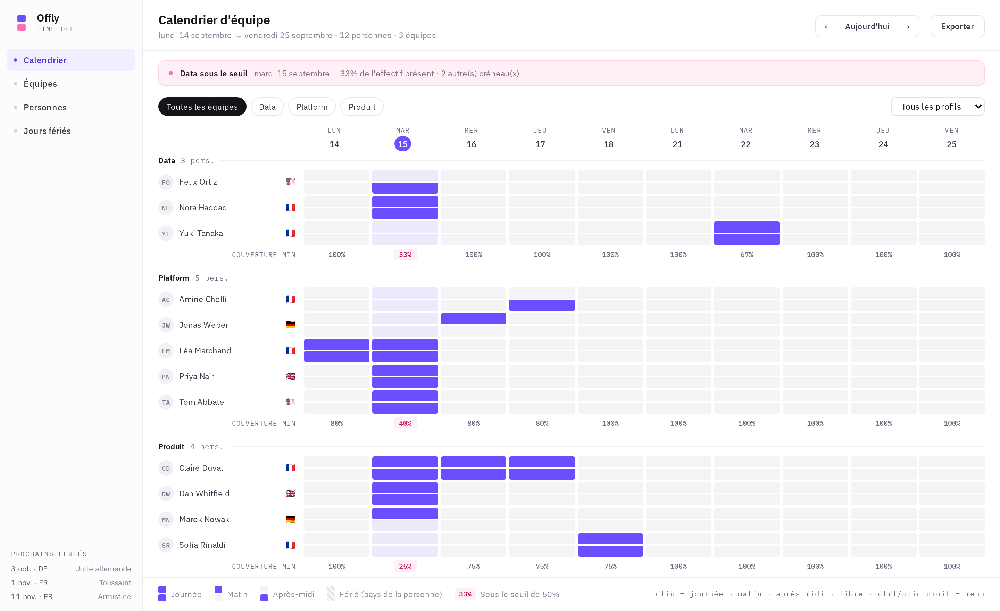
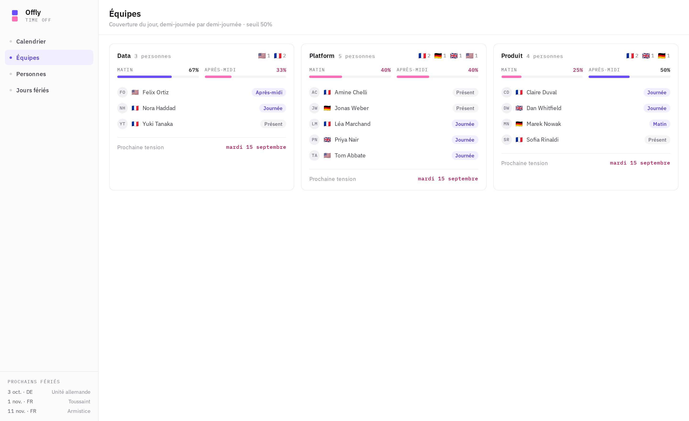
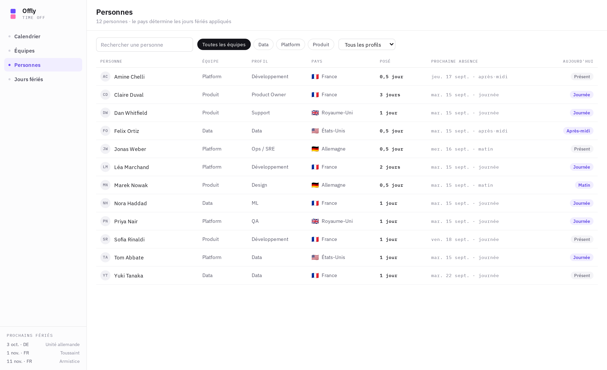
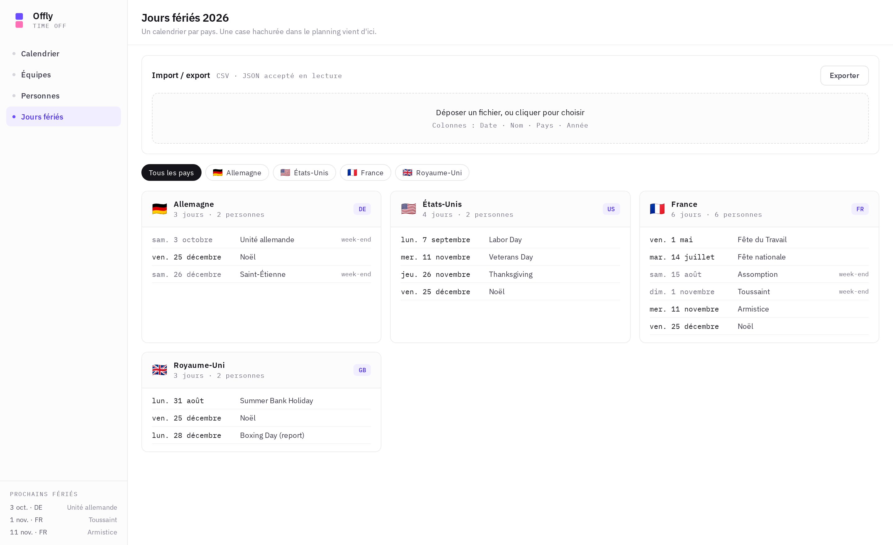

<div align="center">

# 🌴 Offly — Time Off Manager

**Modern absence & time off management. Simple, fast, self-hosted.**

[](https://github.com/BananaOps/offly/releases)
[](LICENSE)
[](https://github.com/BananaOps/offly/actions/workflows/go-test.yml)
[](https://github.com/BananaOps/offly/actions/workflows/protobuf.yml)
[](https://hub.docker.com/r/bananaops/offly)
[](https://hub.docker.com/r/bananaops/offly)
[](https://go.dev)
[](https://nodejs.org)
[](https://vite.dev)
[](https://github.com/BananaOps/offly/stargazers)
[](https://github.com/BananaOps/offly/issues)

</div>

---

> 📖 **New here?** Check out the [Quick Start Guide](QUICKSTART.md) to get up and running in 5 minutes!

## ✨ Features

| Feature | Description |
|---------|-------------|
| 📅 **Half-day grid** | Two-week team planner. One click on a cell posts an absence: full day → morning → afternoon → free |
| 📉 **Coverage threshold** | Per half-day team coverage, always visible. Below 50% the interface flags it — it never blocks |
| 🌍 **Per-country holidays** | A holiday follows the person's country, not the company calendar. Hatched, not clickable, and out of the coverage denominator |
| 👥 **Teams & people** | Team coverage cards, people table with team, job profile, country and next absence |
| 🏷️ **Job profiles** | Filter the planner and the people table by profile; the filter only offers profiles actually in use |
| 📤 **CSV export** | Absences over any date range, scoped to everyone, a team or one person |
| 📥 **CSV import** | Public holidays, with a row-by-row preview before anything is written (JSON also accepted) |
| 🤖 **MCP server** | Optional read-only Model Context Protocol endpoint for LLM agents |
| 🔐 **SSO / OIDC** | Optional SSO authentication via Dex (PKCE flow) |
| 🛡️ **RBAC** | Role-based access control (admin / user) |
| 🚀 **Self-hosted** | Single Docker image — no external services required |

## 📸 Screenshots

| Planner — half-day grid & coverage | Teams — coverage of the day |
|---|---|
|  |  |

| People — profiles & next absence | Holidays — per country, import / export |
|---|---|
|  |  |

## 🏗️ Architecture

```
┌─────────────────────────────────────────────────────────┐
│                     Browser (React)                      │
│      TypeScript · design tokens (CSS) · Vite 8          │
└───────────────────────┬─────────────────────────────────┘
                        │ HTTP / REST          MCP (opt-in)
┌───────────────────────▼─────────────────────────────────┐
│                    Go Backend  :8080                     │
│   /api/  gRPC-Gateway → gRPC :50051 (loopback)          │
│   /mcp   Model Context Protocol      /docs  Swagger UI  │
├─────────────────┬───────────────────────────────────────┤
│   SQLite (default)    │   MongoDB (optional)            │
└───────────────────────┴─────────────────────────────────┘
```

The **single Docker image** embeds both the Go binary and the compiled React SPA. The backend serves the frontend static files and provides the REST/gRPC API.

Every REST call is a real gRPC call: the gateway dials the in-process gRPC server on loopback.

The interface follows **[`design.md`](design.md)** — tokens, tone, component inventory and the product's core rule (you declare a portion of a day, never a leave type). Read it before changing anything visual.

## 🛠️ Tech Stack

| Layer | Technology |
|-------|-----------|
| Backend | Go 1.26, gRPC, gRPC-Gateway, Protocol Buffers, MCP Go SDK |
| Frontend | React 18, TypeScript 5, Vite 8, CSS design tokens |
| Typography | IBM Plex Sans / IBM Plex Mono |
| Database | SQLite (default) · MongoDB (optional) |
| Auth | Dex (OIDC/PKCE), JWT, JWKS |
| Container | Docker (multi-stage, Alpine) |
| Orchestration | Kubernetes · Helm · Skaffold |
| CI/CD | GitHub Actions (SHA-pinned) |

## 📋 Prerequisites

| Tool | Version | Purpose |
|------|---------|---------|
| [Go](https://go.dev) | 1.26+ | Backend |
| [Node.js](https://nodejs.org) | 24+ | Frontend |
| [Task](https://taskfile.dev) | latest | Task runner |
| [Buf](https://buf.build) | latest | Protobuf tooling |
| [Docker](https://docker.com) | latest | Containers |

## 🚀 Quick Start

### Option 1 — Docker Compose (recommended)

```bash
docker-compose up -d
```

The application is available at **http://localhost:8080**

### Option 2 — Local development

```bash
# Clone
git clone https://github.com/BananaOps/offly.git && cd offly

# Install all dependencies and generate protobuf code
task setup

# Start the app (backend + frontend with hot reload)
task dev
```

| Service | URL |
|---------|-----|
| Web UI | http://localhost:3000 |
| REST API | http://localhost:8080/api/v1 |
| Swagger UI | http://localhost:8080/docs |
| gRPC | localhost:50051 |

### Seed test data

```bash
# Requires k6 — see k6-README.md
k6 run k6-seed-data.js
```

Creates 5 departments, 10 teams, 12 users, 29 public holidays, and random absences.

## 🐳 Docker

```bash
# Pull & run (in-memory storage — no DB required)
docker run -p 8080:8080 bananaops/offly:latest

# With persistent SQLite
docker run -p 8080:8080 \
  -v $(pwd)/data:/app/data \
  bananaops/offly:latest

# With MongoDB
docker run -p 8080:8080 \
  -e STORAGE_TYPE=mongodb \
  -e MONGO_URI=mongodb://host.docker.internal:27017 \
  bananaops/offly:latest
```

See [DOCKER.md](DOCKER.md) for the full deployment guide.

## ☸️ Kubernetes (Helm)

```bash
# Add the chart repository
helm repo add offly https://bananaops.github.io/offly
helm repo update

# Install
helm install offly offly/offly

# Install a specific version
helm install offly offly/offly --version 0.1.0

# Upgrade
helm upgrade offly offly/offly
```

## ⚙️ Environment Variables

| Variable | Description | Default |
|----------|-------------|---------|
| `STORAGE_TYPE` | `sqlite` or `mongodb` | `sqlite` |
| `SQLITE_DB_PATH` | SQLite database path | `/app/data/offly.db` |
| `MONGO_URI` | MongoDB connection string | `mongodb://localhost:27017` |
| `HTTP_PORT` | HTTP server port | `8080` |
| `GRPC_PORT` | gRPC server port | `50051` |
| `AUTH_ENABLED` | Enable SSO authentication | `false` |
| `AUTH_ISSUER_URL` | OIDC issuer URL | — |
| `AUTH_CLIENT_ID` | OIDC client ID | — |
| `AUTH_CLIENT_SECRET` | OIDC client secret, used on the callback exchange | — |
| `AUTH_JWKS_URL` | JWKS endpoint | `<issuer>/keys` |
| `AUTH_JWKS_CACHE_TTL` | JWKS cache lifetime, in seconds | `3600` |
| `AUTH_ADMIN_EMAILS` | Comma-separated emails granted the `admin` role (`ADMIN_EMAILS` also read) | — |
| `MCP_ENABLED` | Expose the read-only MCP server at `/mcp` | `false` |

`HTTP_PORT` and `GRPC_PORT` are read at startup; an unparseable value logs a warning and falls
back to the default. gRPC always binds to loopback — it is reached only by the in-process gateway.

## 🔐 SSO Authentication

Offly supports optional SSO via [Dex](https://dexidp.io) (OIDC/PKCE flow).

```
Browser ──PKCE──▶ Dex ──ID Token──▶ Backend ──JWT verify──▶ SQLite
```

| Role | Permissions |
|------|------------|
| `admin` | Full access — users, teams, holidays, absences |
| `user` | Read all · Edit own profile & absences only |

See [SSO-README.md](SSO-README.md) for the full configuration guide.

## 🤖 MCP Server

Offly can expose its data to LLM agents through the [Model Context Protocol](https://modelcontextprotocol.io).
Set `MCP_ENABLED=true` and the server serves the streamable HTTP transport at **`/mcp`**, on the
same port as the REST API — no extra binary, no extra port.

| Tool | Description |
|------|-------------|
| `list_users` | Every user with team, country and job profile |
| `list_teams` | Teams, optionally filtered by department, with member counts |
| `list_absences` | Absences overlapping a `YYYY-MM-DD` date range |
| `list_holidays` | Public holidays, optionally filtered by country and year |
| `team_presence` | Who is present/away in a team on a day, accounting for absences **and** each member's public holidays |

Register it with Claude Code:

```bash
claude mcp add --transport http offly http://localhost:8080/mcp
```

> ⚠️ **The endpoint is unauthenticated and must not be exposed publicly.** It bypasses the
> `AUTH_ENABLED` / RBAC layer entirely — anyone who can reach `/mcp` can read every absence.
> Keep it on an internal network or behind an authenticating proxy.
>
> All tools are **read-only**. Writes are deliberately not exposed: the "users may only modify
> their own absences" rules live in the HTTP middleware and are not reachable from the MCP
> handlers, so a write tool would let any caller act on behalf of anyone.

## 🔌 API

### REST (port 8080)

Interactive documentation available at **http://localhost:8080/docs**

| Method | Endpoint | Description |
|--------|----------|-------------|
| `GET` | `/api/v1/health` | Health check |
| `GET/POST` | `/api/v1/users` | List / create users |
| `GET/PUT/DELETE` | `/api/v1/users/{id}` | Get / update / delete user |
| `GET/POST` | `/api/v1/teams` | List / create teams |
| `GET/POST` | `/api/v1/absences` | List / create absences |
| `PUT/DELETE` | `/api/v1/absences/{id}` | Update / delete absence |
| `GET/POST` | `/api/v1/holidays` | List / create public holidays |
| `GET` | `/api/v1/auth/config` | SSO configuration |
| `POST` | `/api/v1/auth/ensure-user` | Auto-provision SSO user |

### gRPC (port 50051)

Services: `AbsenceService` · `UserService` · `OrganizationService` · `HolidayService`

## 🧰 Task Commands

```bash
task setup            # Install deps + generate protobuf code
task dev              # Start backend + frontend (hot reload, SQLite — no external service)
task build            # Build the full application
task test             # Run all tests
task lint             # Lint backend + frontend
task format           # Format backend + frontend
task proto            # Regenerate protobuf code
task proto:lint       # Lint protobuf definitions
task mongo:start      # Start MongoDB in Docker
task mongo:stop       # Stop MongoDB
task pre-commit       # Format + lint + test (run before committing)
task clean            # Remove generated files
```

## 📁 Project Structure

```
offly/
├── backend/
│   ├── cmd/server/          # Server entry point
│   ├── internal/
│   │   ├── auth/            # OIDC, JWT, RBAC middleware
│   │   ├── mcp/             # Read-only MCP server (opt-in)
│   │   ├── service/         # gRPC service implementations
│   │   └── storage/         # SQLite + MongoDB adapters
│   └── proto/               # Protocol Buffer definitions
├── frontend/
│   └── src/
│       ├── components/offly/  # The interface (see design.md)
│       │   ├── OfflyApp       # Shell: data + screen switching
│       │   ├── Rail           # Navigation
│       │   ├── CalendarScreen # Half-day grid, coverage, entry
│       │   ├── TeamsScreen · PeopleScreen · HolidaysScreen
│       │   ├── ExportMenu     # CSV export of absences
│       │   └── HolidayTransfer# Holiday import / export
│       ├── design/offly.css   # Design tokens
│       ├── lib/
│       │   ├── halfday.ts     # am|pm|full model, coverage
│       │   ├── csv.ts         # CSV read / write
│       │   └── profiles.ts    # Job profile labels
│       ├── api.ts             # REST API client
│       ├── auth.ts            # PKCE / JWT helpers
│       └── types.ts           # TypeScript types
├── design.md                # Design system — read before any visual change
├── helm/offly/              # Helm chart for Kubernetes
├── dex/                     # Dex OIDC provider (dev/test)
├── Dockerfile               # Multi-stage build (frontend + backend)
├── docker-compose.yml       # Local stack
├── Taskfile.yml             # Task automation
└── k6-seed-data.js          # Test data generator
```

## 🤝 Contributing

Contributions are welcome! We follow [Conventional Commits](https://www.conventionalcommits.org/):

```bash
git commit -m "feat: add new absence type filter"
git commit -m "fix: correct date calculation in calendar"
git commit -m "docs: update API reference"
```

Types: `feat` · `fix` · `docs` · `chore` · `ci` · `refactor` · `perf` · `test`

Releases are automated via [Release Please](https://github.com/googleapis/release-please).

## 🐛 Troubleshooting

<details>
<summary><b>MongoDB won't start</b></summary>

```bash
task mongo:stop && task mongo:start
```
</details>

<details>
<summary><b>Protobuf compilation errors</b></summary>

```bash
task install:backend
task proto:lint   # Check for syntax errors
task proto        # Regenerate
```
</details>

<details>
<summary><b>Frontend dependency issues</b></summary>

```bash
cd frontend && rm -rf node_modules package-lock.json && npm install
```
</details>

<details>
<summary><b>SSO / Dex issues</b></summary>

See [SSO-README.md](SSO-README.md) for detailed troubleshooting steps.
</details>

## 📄 License

Released under the [MIT License](LICENSE) — © BananaOps

---

<div align="center">

**[Documentation](https://github.com/BananaOps/offly)** · **[Issues](https://github.com/BananaOps/offly/issues)** · **[Discussions](https://github.com/BananaOps/offly/discussions)** · **[Docker Hub](https://hub.docker.com/r/bananaops/offly)**

Made with ❤️ by [BananaOps](https://github.com/BananaOps)

</div>
